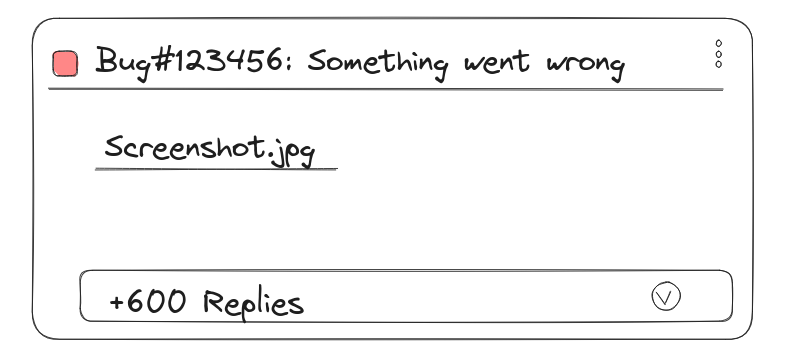

# Где моя документация, чувак?

[en](../en/index.md)

> Disclaimer:
> Персонажи, компания, ситуация, названия брендов, ~~смысл жизни?~~ - выдуманы.
> Любые совпадения скорее всего абсолютно случайны.

## Итак...
Наверняка у вас была ситуация, когда вы только-только устроились на новое место работы и начинаете погружаться в новое окружение. Независимо от вашего опыта - год, пять лет или это ваша первая работа: вы - новичок здесь, и что-то для вас в новинку. Конечно, чем больше у вас опыта, тем больше вы видите знакомого вокруг: таск-трекер, дейлики, иерархия управления, коллеги со знакомыми вам названиями ролей, инструментарий и подходы к разработке - вы это уже видели. Но всё-таки призрак новизны витает в воздухе и нужно его поймать и прогнать - нужно погрузиться в поток процессов и решений для этого проекта и этой системы, в которой проект создаётся.

Ведь чем быстрее всё станет привычным, тем быстрее вы начнёте приносить ***ТО САМОЕ***, название которого как мантру из священных писаний по управлению персоналом менеджеры повторяют день за днём, чтобы это название въелось в подсознание и осталось там навсегда - **business value**. 

Проще говоря - **пользу** для компании.
В этом заинтересованы все, и вы - в первую очередь, чтобы продолжить находиться на этой должности и возможно даже подняться выше. Согласны?
Вы проходите процесс адаптации, где коллеги рассказывают вам о проекте - где что находится и что за что отвечает:

*"Вот тут у нас слой презентации, вот тут у нас слой работы с бд, вот тут бизнес-логика... Этот микросервис делает то-то, этот другое... вот тут кафка, вот редис... Вот схема как это *примерно* связано друг с другом, она *немного не актуальна*, но по сути верная... А вот здесь вся документация о системе...."*

И перед вами открывается страница корпоративной системы *crowdfluence* ("Спасибо, что не *Lotion*" - думаете вы) с порядком пятидесяти разделов с подразделами с подразделами, где самое последнее изменение было полгода назад...

"Хотя бы здесь ЕСТЬ документация..." - думаете вы, остерегаясь задать себе следующие вопросы:

- "Сколько времени уйдёт на чтение и понимание?"
- "Поможет ли это в том, чтобы быстрее начать быть полезным?"

И, поразмыслив немножко (и, возможно, даже пробежавшись глазами по разделам), решаете, что разберётесь по ходу работы...

Проходит где-то месяц вашей работы в проекте. Вы начали понимать как работают некоторые части системы, но далеко не всё - проект достаточно большой, и бизнес-логики достаточно много.

И вот однажды на планёрке вам поручают задачу разобраться с новым багом. Это достаточно неприятный баг, но он не настолько критичный, чтобы кто-то из старожил отложил все свои дела по новым фичам и разобрался с ним. Его поручают вам.

Вы тратите день-два на исследование, которое, к сожалению, не даёт вам ответа на вопрос "В чём *причина* такого поведения?".
Вы поискали по ключевым словам описание доменных сущностей в документации проекта описание модулей, в которых (как вы предполагаете) содержится причина бага, но увы не нашли ответы на свои вопросы.

Вы часами медитировали над кодом, перескакивая между файлами в местах вызовов методов.
Код блестяще написан - видно, что люди его писавшие старались придерживаться хороших практик и держать уровень качества. Тесты есть - их много, и показатели покрытия кода тестами крайне высоки. Каждый модуль, каждая публичная функция снабжены описанием. У вас есть тонны и тонны информации, сообщающей "**что** тот или иной код делает", но вы всё ещё не понимаете "**почему** он так реализован".

После этого вы решаете осаждать коллег вопросами, о том "почему сейчас такая реализация?". Ведь мало найти место, где система *отклоняется от ожидаемого* - ещё нужно понять *как правильно вернуть систему на "рельсы нормального поведения", не сломав ничего в процессе исправления*.

Один из коллег, рассказывает вам, что припоминает как "что-то такое *связанное* с этой проблемой когда-то обсуждалось, и Фёдор К. чинил что-то подобное, но он уже давно уволился. Вот *ссылка* на задачу. Можно взять контекст из обсуждения..."

Вы переходите по ссылке и видите *это*:

Знакомо?

Изучив обсуждение, вы понимаете, что фикс данного бага был временным решением, чтобы закрыть ошибку, возникшую в результате получения данных из сервиса, с которым была интеграция. Вы даже натыкались на изменения, связанные с этим багом, и IDE показывала их.

Но откуда вам было знать, что временное решение должно было быть убрано, когда внешний сервис начнёт присылать данные ожидаемым путём?

Ниоткуда, и вот почему:

- Вас не было здесь, когда производилась интеграция с внешним сервисом
- Вас не было здесь, когда проблема возникла
- Вас не было здесь, когда она обсуждалась и исправлялась
- У вас не было явной дорожной карты, показывающей вам путь к решению задачи

Короче говоря - у вас абсолютно не было **контекста** произошедшего.
В результате чего, исправление бага превращается в детективное расследование (где, как известно, главное - не выйти на самих себя).

Документация, несмотря на всю свою полноту и многословность, описывает достаточно общо работу системы не отражает таких вещей, как временное решение. А зачастую и многое из постоянного.

## Что есть документация?
> Автор под документацией подразумевает вообще все знания о системе: технические, нетехнические, архитектурные, бизнесовые, и т.д.

**Документация** - это **непротиворечивый**, **актуальный на текущий момент времени** документ или набор документов предоставляющие знания о проекте:
- Идея проекта, цели и задачи, которые проект решает (зачем этот проект?) - это raison d'être[^1] выстраиваемой системы. (Примечание: "получение прибыли" - никогда не является целю проекта. Это может быть целю владельца проекта)
- Требования к проекту (какие ограничения у проекта?)
- План развития проекта (как будут достигнуты цели проекта?)
Эти знания должны быть продуманы и описаны **изначально**.

И прежде, чем вы успеете сказать, что waterfall мёртв и показал свою неэффективность, и что сегодня правит бал agile...

Описанное выше это необходимая, но недостаточная часть для **ДОЛГОСРОЧНОГО** и **КОМПЛЕКСНОГО** проекта: если она меняется, то проект должен завершиться и начаться новый (возможно заимствуя что-то из текущего) - соответсвующий новым идее и задачам или новым требованиям.

В противном случае может оказаться, что [Бурдж-Халиф](https://ru.wikipedia.org/wiki/%D0%91%D1%83%D1%80%D0%B4%D0%B6-%D0%A5%D0%B0%D0%BB%D0%B8%D1%84%D0%B0) только что назначили скромным семейным кафе и уже собираются менять фундамент, на котором он стоит.

Детали о том "как" и "что" будет делаться для соответствия целям и требованиям проектной системы в рамках плана развития могут дополняться, корректироваться, **если не идёт в разрез с основой**.
Более того - новые детали **ДОЛЖНЫ** найти своё место в документации.
"Насколько подробно?", спросите вы. В идеальном варианте, чтобы документация была отражением работающей на текущий момент системы без дополнительного стороннего контекста для читателя. Это вероятно могут быть разные документы. Однако, *в любой момент времени необходимо иметь доступное для понимания описание поведения системы и причины такого поведения*.

Цель документирования - иметь под рукой ***знания*** о работе системы, и отражать её текущее состояние, для решения рабочих задач - пресловутый **контекст** - а не быть ***просто информацией*** описывающей систему.
Если угодно, то документация - это прокаченная дорожная карта системы или навигатор с реками, горами, дорогами, показывающих как попасть из точки "А" в точку "Б" **в текущий момент времени**, с учётом погодных условий, времени суток и трафика на дорогах.

[^1]: Смысл существования (fr.)

## Где живёт контекст?
> Словом *контекст* в рамках статьи автор называет знания о работе системы, в том числе о причинах такой работы.
> Т.к. основываясь на *контексте* принимаются решения об изменении и развитии системы.

Согласно (исключительно субъективной) статистике, *контекст* можно найти:
- в ~~базе знаний~~ сборнике информации, где сконцентрировано описание основных элементов системы;
- в таск-трекере с описанием фич, инцидентов, распределением задач по сотрудникам и временем их выполнения, а также с комментариями к задачам;
- в мессенджерах, где также активно проходят обсуждения задач, размазывая ответ на вопрос "что и как должно быть сделано?" на сотни и сотни сообщений в разных группах;
- в системе контроля версий, где можно найти кто, когда что-то добавил\удалил\изменил и в связи с какой задачей в таск-трекере это произошло;
- в системах управления репозиторием, где иногда в добавок к списку изменений можно так же найти обсуждения в рамках код-ревью решения;
- в коде, где у вас есть полное описание того **как** выстроена логика исполнения на данный момент (но без данных с прода... без реальной инфраструктуры... без ответа на вопрос "**почему** система сделана именно так?"). Здесь в коде можно так же встетить `TODO: переделать позже. TASK#1234567`;
- в тестах (у вас ведь есть ВСЕ ТЕСТЫ на ВЕСЬ функционал?);
- в почте, где по крайней мере раньше обсуждались решения, особенно с внешними агентами компании (удачи получить рабочую переписку, Фёдора К.);
- на митингах и созвонах (они ведь записываются? Записываются ведь?);
- в головах у коллег (отложите, пожалуйста, пилу хирурга... и попробуйте найти Фёдора К.);

Учитывая всё вышеперечисленное, попробуйте ответить на вопрос:
"Сколько действий вам нужно сделать, чтобы погрузиться в контекст решаемой задачи?"

Даже при самом благоприятной картине, чтобы ответить на вопрос: "**почему** система работает так как она сейчас работает и как она **должна** работать?" вам, будучи разработчиком необходимо:

В системе контроля версий найди коммит -> по коммиту найти задачу -> по номеру задачи найти описание задачи в таск-трекере -> в таск-трекере найти ссылку на документацию -> пройти по ссылке в раздел документации, и *может быть* в конце этого пути из хлебных крошек вы увидите ответ на вопрос "**почему** так, и как должно быть на самом деле?"

## Ложка дёгтя...
...которую в и без того нерадостную картину в наши дни добавляет "прогресс". Когда-то кому-то в голову пришла идея генерировать документацию и тесты на основе текущей кодовой базы. Этот кто-то вероятно упустил, что описание системы (документация) является **причиной** появления реализации (исполняемого кода), а **не следствием**. И, если развивать мысль - термин "**исходный** код" (в данном случае акцент на слово "исходный") больше подходит к документации нежели к реализации. В защиту данного утверждения в этот "курино-яичный" вопрос, можно привести факт, что даже под самым тщательным и пристальным взглядом исполняемый код мало что может рассказать о причинах своего появления. 

> REM: Здесь автор хотел бы передать привет, сторонникам идеи "самодокументируемого кода".

## Ложка мёда...
Беглое исследование по поиску решения проблемы, связанной с поддержанием документации системы в актуальном состоянии, подсветило несколько интересных инструментов и подходов.
Одной из таких идей является [docs-as-code](https://www.writethedocs.org/guide/docs-as-code/), когда *документация изменяется в той же мере и таким же образом, как и исполняемый программный код*, реализующий идеи заложенные в документацию. Что, кажется, можно зачесть как подтверждение обозначенностью проблемой, если не повсеместно, то хотябы где-то ещё.

## Место для шага вперёд
Как можно развить идею документации, меняющейся в процессе разработки, с сохранением её актуальности, полноты, по возможности прозрачности, с минимальными накладными расходами?

Чтобы попытаться найти ответ на этот вопрос, стоит сначала проанализировать "общепринятый" подход практикуемый в разработке:
1. Возникает идея или потребность добавить новый функционал в систему;
2. Собирается группа людей (стек холдеры, аналитики, архитекторы, менеджеры....) и они прорабатывают эту идею за несколько встреч;
3. По итогам этой встречи получается **документ**, который общо описывает вИдение того, что должно получится;
4. Создаётся задача в таск-трекере (с типом story, epic, или epic story, или вообще legend heroic epic story), с описанием того **что** нужно сделать и **зачем**, а также прикладывается имеющийся **документ**;
5. Далее аналитик c менеджером и командой разработки обсуждает **описание идеи** на предмет **полноты**, **понятности** и **непротиворечивости по отношению к текущей системе** (в процесс обсуждения постоянно пытается вклиниться скрам-мастер, которому очень интересно узнать "сколько стори поинтов займёт разработка того или иного функционала и почему так много");
6. Ленендарно-героическо-эпическая-история декомпозируется на менее ~~легендарные~~ объёмные задачи и распределяется между участниками команды разработки;
7. Функционал реализуется, тесты на новый функционал пишутся, собирается релиз;
8. Релиз обкатывается на тестовом стенде, демонстрируется на предпродовом стенде;
9. Находятся недоработки, которые фиксятся (задача в таск-трекере, линковка с эпиком и текущим релизом и т.д.) дальше всё повторяется с пункта (7) пока функционал не будет достаточно хорош, чтобы его выпустили к реальным пользователям;
10. Ленендарно-героическо-эпическая-история заканчивается;
11. Возможно появляются новые записи в сборнике информации (но это не точно);
12. Цикл повторяется сначала...

> В написанной последовательности процесса, намеренно опущены многие шаги.
> В противном случае это напоминало бы размашистый ясень [Иггдрасиль](https://ru.wikipedia.org/wiki/%D0%98%D0%B3%D0%B3%D0%B4%D1%80%D0%B0%D1%81%D0%B8%D0%BB%D1%8C), держащий все девять миров.

Вы возможно заметили, что в описанном процессе у команды разработки был момент, когда они в одно и то же время в одном и том же месте разделяли один и тот же **контекст** созданный на основе **документа**, но, к сожалению, потом этот контекст распался на множество мелких контекстов в разных местах и потерял связь первоисточником. Запись в сборник информации была сделана постфактум, и эта запись не позволит человеку понять "как и почему так работает система" без дополнительного расследования.

А почему бы не изменить процесс и не вносить изменения в систему вместе с документацией, с оглядкой на подход docs-as-code? 
В этом случае описание функционала или его изменение получается неразрывно связано с самим функционалом:
- "бесплатно" функционал и описание синхронизировано, в том числе во времени за счёт системы контроля версий;
- нет необходимости шариться по сотням мест, чтобы собрать весь **необходимый и достаточный** контекст - вот он здесь рядом с самими изменениями;
- документацию можно при желании собрать в единый документ, который будет отражать текущее поведение системы;
- "бесплатно" появляется ещё один уровень валидации: при внесении изменений в код меняющих логику - следует их описать. Ведь что-то же изменилось, иначе в чём суть работы? (это почти как тесты, но написанные обычными словами);

Поддержание "контекста" в таком случае в актуальном состоянии будет проще за счёт инертности процесса. Если после анализа задачи уже есть текстовое описание что и зачем нужно сделат: почему бы не сделать это "первым кирпичиком" решения? почему бы не начать MR, где первым коммитом будет это описание?

В таком случае процесс будет выглядеть так (первые 6 пунктов остаются без изменений):

(7). Описание того что должно быть сделано - иными словами **к какому состоянию должна придти система** в рамках конкретной задачи - заносится первым коммитом в ветке системы контроля версий. Таким образом участники вместе соглашаются на эти изменения.

(8). Функционал реализуется, **опираясь** на документацию, тесты на новый функционал пишутся, **опираясь** на документацию, собирается релиз;

И далее по плану...

В чём же разница?

В отличае от "традиционного" процесса, при помощи системы контроля версий участники видят и знают **из какого состояния система переходит** и **в какое должна прийти**, а так же в идеале видят **почему система меняет своё состояние**. И описание этих изменений подкрепляются самими изменениями здесь же. Что обеспечивает автоматическую "бесплатную" синхранизацию между системой и знаниями о ней.

Для нового участника команды, количество место для поиска ответа при возникновении проблемы кратно сокращено. Так же сокращён и объём информации, с которым нужно ознкомиться, чтобы эту проблему решить - потому что вся информация дистиллирована до **знания** о том когда, как и почему произошли изменения из состояния системы А до состояния Б.

"Бесплатно" - умышленно поставлено в кавычки и нужно ещё обособить это слово множеством больших знаков вопроса. Вопросов как к самой идее концептуально, так и вопросов касающихся реализации идеи на практике. Потому что, как известно, "бесплатного" ничего не бывает.

Если плюсы такого подхода перечислены - при желании можно найти больше плюсов и даже более весомых, чем описанных выше. То каковы минусы? 

Какова же плата? И чем придётся жертвовать?

На ум приходит ещё одна мантра, которую часто произносят - **TTM** (time to market). Ведь *в моменте* необходимо дополнительно тратить время на преобразование контекста задачи в **знание о системе** - в **документацию**. 

Однако, чем больше будет расхождение между текущем состоянием системы и **знанием о ней** - тем больше будет потрачено времении **каждым** кому будет необходимо эту разницу наверстать для **решения задачи в моменте**, и с каждым циклом изменения системы будет всё сложнее и сложнее нивелировать как **качественную** так и **количественную** разницу между знаниями о системе и её текущем состоянии. Что в конечном итоге может привести к **непознаваемости системы** в принципе.

Таким образом потраченное в моменте время принесёт свои плоды в долгосрочной перспективе. Она ведь есть у компании, в которой вы работаете?
